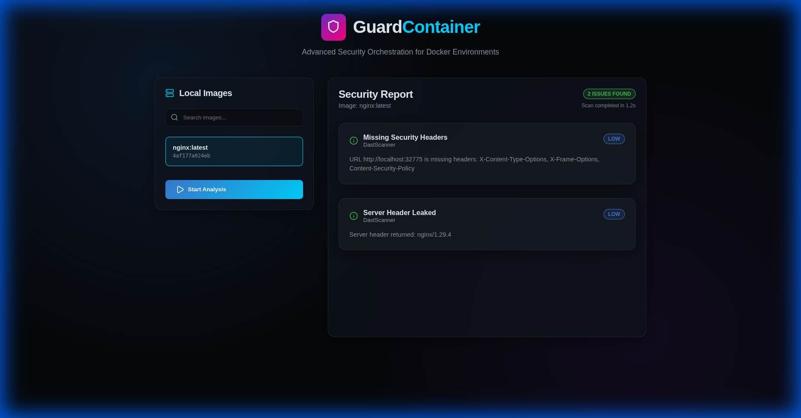

# GuardContainer

High-performance container security orchestration and scanning engine rewritten in Go. GuardContainer provides a modular framework for auditing Docker images against configuration best practices, static analysis (SAST), and dynamic probing (DAST).



## Overview

GuardContainer is a senior-level security tool designed to identify vulnerabilities and misconfigurations in Docker images before they reach production. By leveraging the official Go Moby SDK, it offers superior performance and concurrency compared to traditional scripting approaches.

## Key Features

- **Multi-Layer Scanning Engine**:
    - **Config Audit**: Inspects image metadata for root user execution, missing healthchecks, and exposed sensitive ports.
    - **Secret Detection (SAST)**: Performs high-speed filesystem analysis to detect leaked credentials, API keys, and private certificates.
    - **Dynamic Probing (DAST)**: Spins up ephemeral containers to verify HTTP security headers and identify leaked server metadata.
- **Premium Web Dashboard**: A modern, glassmorphic React interface for visual scan orchestration and real-time reporting.
- **CLI first**: Full support for automated CI/CD pipelines with JSON export capabilities.
- **Senior Architecture**: Built with a clean, modular Go structure (`/cmd`, `/internal`, `/web`) for maximum maintainability.

## Installation

### Prerequisites
- Go 1.23+
- Docker Engine
- Node.js (for frontend modifications)

### Build
```bash
# Clone the repository
git clone <repository-url>
cd Container-scanner

# Build the binary
go build -o container-scanner cmd/container-scanner/main.go
```

## Usage

### Web Interface
Launch the premium dashboard:
```bash
sudo -E ./container-scanner serve --port 8080
```
Then navigate to `http://localhost:8080`.

### CLI Scanning
Perform a fast, one-time scan:
```bash
sudo -E ./container-scanner scan <image_name> --json report.json
```

## Project Structure

- `cmd/container-scanner`: Main application entry point.
- `internal/scanners`: Core scanning logic and interface definitions.
- `internal/api`: REST API implementation for the web interface.
- `internal/utils`: Docker SDK wrappers and filesystem utilities.
- `web/ui`: Modern React frontend source code and assets.


## Concurrency
- **Parallel Scanning**: Instead of sequential processing, GuardContainer uses **Goroutines** and `sync.WaitGroup` to run all configured scanners in parallel. For a single image, this reduces total scan time to the duration of the slowest scanner.
- **Asynchronous HTTP**: The Go `http` server handles each request in a dedicated goroutine, ensuring that one heavy scan never blocks the entire API for other users.

## Security
- **Local Enforcement**: By default, the API server binds strictly to `127.0.0.1`. This prevents the tool (which often requires elevated privileges) from being exposed to the network.
- **Input Sanitization**: All image names are sanitized and validated to prevent command injection or path traversal attempts before reaching the Docker SDK.
- **Process Isolation**: DAST scans are performed inside ephemeral, isolated containers with limited privileges.

## Performance
- **In-Memory Caching**: Implemented a thread-safe global cache for scan results. Re-scanning the same Image ID returns results instantly (marked in the API as `cached: true`), significantly reducing Docker daemon overhead.
- **Stateless Design**: The scanner doesn't store heavy intermediate files, using streams where possible to minimize memory footprint.

## License
MIT
